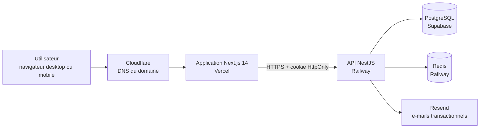
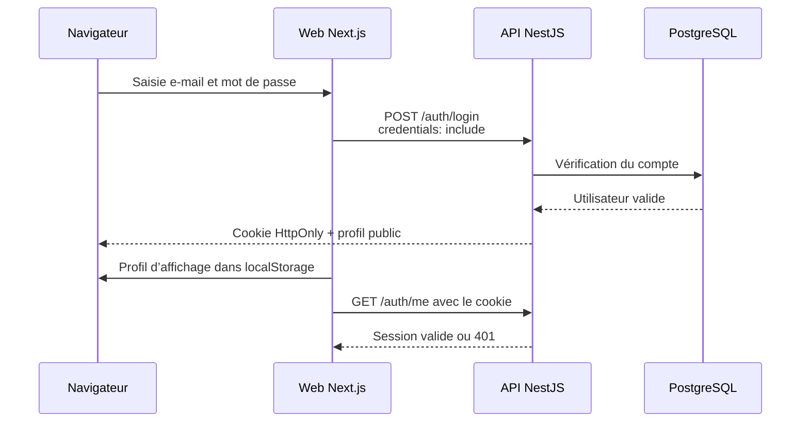

# Architecture de l’application web Kalymap

Dernière mise à jour : 24 août 2026

## 1. Périmètre

Ce document décrit uniquement l’application web située dans `apps/web`. La partie mobile Expo et l’implémentation interne du serveur NestJS sont hors périmètre, sauf lorsqu’elles influencent les échanges entre le navigateur et l’API.

L’application web permet notamment :

- d’utiliser les parcours de régulation émotionnelle en mode invité ;
- de créer et confirmer un compte, se connecter et réinitialiser son mot de passe ;
- d’accéder aux exercices d’hyperactivation, d’hypoactivation et de fenêtre de tolérance ;
- de conserver un historique, des objectifs, des notes et une routine pour un utilisateur authentifié ;
- d’exporter ses données et de supprimer son compte ;
- d’accéder aux informations d’urgence, aux CGU et à la politique de confidentialité.

## 2. Vue d’ensemble



En production :

- le site public est servi sous `https://www.kalymap.com` ;
- le frontend est construit et hébergé par Vercel ;
- les appels métier sont envoyés à `https://api.kalymap.com/api` ;
- l’API est hébergée par Railway ;
- PostgreSQL conserve les données durables ;
- Redis partage les compteurs de limitation de requêtes ;
- Resend envoie les messages de confirmation et de réinitialisation.

## 3. Socle technique

| Élément | Choix actuel |
|---|---|
| Framework | Next.js `14.2.35`, App Router |
| Interface | React `18.2.0` et TypeScript `5.4.5` |
| Gestionnaire de paquets | pnpm, dans un monorepo |
| Version Node cible | Node.js `22.x` |
| Styles | Styles React en ligne, blocs CSS locaux et quelques variables CSS globales |
| Navigation | `next/navigation`, liens HTML et composant `BackLink` |
| Tests navigateur | Playwright |
| Hébergement web | Vercel |
| Génération de documents | jsPDF et jsPDF AutoTable |

Le web ne possède pas de gestionnaire d’état global externe. L’état est réparti entre les états React locaux, quelques utilitaires partagés et le `localStorage` pour les préférences non sensibles.

## 4. Organisation des sources

```text
apps/web/
├── app/                    Routes et layouts Next.js
│   ├── layout.tsx          Layout racine et composants transverses
│   ├── page.tsx            Page d’accueil publique
│   ├── app/page.tsx        Accueil fonctionnel et paramètres
│   ├── exercice/           Parcours et écrans d’exercices
│   ├── tolerance/          Historique, routine, notes et objectifs
│   └── ...                 Authentification, urgence et pages légales
├── components/             Composants transverses et métier
├── hooks/                  Hooks utilitaires
├── lib/                    API, session, catalogue et suivi utilisateur
├── public/                 Images, icônes et fichiers audio
├── tests/e2e/              Scénarios Playwright
├── middleware.ts           Content Security Policy avec nonce
├── next.config.mjs         Configuration et en-têtes de sécurité
└── vercel.json             Configuration de déploiement Vercel
```

La majorité des pages interactives utilisent la directive `'use client'`. Le layout racine reste un composant serveur et récupère le nonce CSP transmis par le middleware.

## 5. Carte fonctionnelle des routes

### Accès public et authentification

| Route | Rôle |
|---|---|
| `/` | Accueil public et entrée vers le mode invité ou la connexion |
| `/signup` | Création d’un compte utilisateur |
| `/verify-email` | Confirmation de l’adresse e-mail |
| `/login` | Connexion |
| `/forgot-password` | Demande de réinitialisation |
| `/reset-password` | Choix d’un nouveau mot de passe |
| `/health` | Vérification de disponibilité de l’API |
| `/terms` | Conditions générales d’utilisation |
| `/privacy` | Politique de confidentialité |

### Application et assistance

| Route | Rôle |
|---|---|
| `/app` | Écran central, choix de l’état émotionnel, paramètres et compte |
| `/hyperactivation` | Catalogue d’exercices pour l’hyperactivation |
| `/hypoactivation` | Catalogue d’exercices pour l’hypoactivation |
| `/tolerance` | Espace de la fenêtre de tolérance |
| `/sos` | Aide immédiate |
| `/emergency` | Informations et contacts d’urgence |
| `/plan` | Plan de crise personnel |

### Données et routine utilisateur

| Route | Rôle |
|---|---|
| `/tolerance/historique` | Historique des états enregistrés |
| `/tolerance/objectifs` | Gestion des objectifs |
| `/tolerance/notes` | Liste des notes |
| `/tolerance/notes/[id]` | Consultation ou modification d’une note |
| `/tolerance/notes/guides` | Aide à la rédaction |
| `/tolerance/routine` | Exercices favoris et routine |

### Exercices

Les routes sous `/exercice` couvrent notamment la respiration, l’ancrage, la roue des émotions, la pleine conscience, les SBA, le lieu sûr, la trousse émotionnelle et les exercices de réveil corporel. Le catalogue central se trouve dans `lib/exerciseCatalog.ts`.

## 6. Layout et composants transverses

Le layout racine `app/layout.tsx` monte les éléments communs à toutes les pages :

- le thème et sa couleur navigateur ;
- le splash screen ;
- le pont de navigation vers les paramètres ;
- la fenêtre de check-in émotionnel après connexion ;
- les styles globaux minimaux et la gestion responsive du viewport.

`SettingsNavigationBridge` intercepte le bouton Paramètres en dehors de `/app`, mémorise la page courante dans `returnTo`, puis ouvre les paramètres sur `/app`. Cette logique permet de conserver un point d’accès aux paramètres depuis les parcours d’exercice.

`StateCheckinPrompt` est affiché une fois par connexion pour un utilisateur authentifié de rôle `PATIENT`. Le choix est envoyé à l’API et alimente l’historique.

## 7. Session et authentification



La sécurité de la session repose sur le cookie émis par l’API :

- le cookie est `HttpOnly`, donc inaccessible au JavaScript du navigateur ;
- en production, il est `Secure` et `SameSite=Lax` ;
- tous les appels authentifiés utilisent `credentials: 'include'` ;
- `/auth/me` valide la session auprès du serveur ;
- un `401` ou `403` confirmé efface l’état local et renvoie vers `/login` ;
- une erreur réseau temporaire ne déconnecte pas automatiquement l’utilisateur.

`lib/session.ts` conserve uniquement un profil d’affichage et des marqueurs d’interface dans le `localStorage`. Aucun jeton d’accès n’y est stocké. Une ancienne clé `kalymapAuthToken` est supprimée automatiquement pour nettoyer les installations antérieures.

Les événements `mawja-session-changed`, `storage` et `pageshow` synchronisent l’interface entre les composants, les onglets et les retours du navigateur mobile.

Deux modes sont distingués :

- `guest` : accès aux contenus disponibles sans compte ;
- `authenticated` : accès aux fonctions persistantes liées au compte.

Les rôles `PATIENT` et `DOCTOR` existent encore techniquement. L’expérience médecin est désactivable par feature flag et n’est pas le chantier actuel.

## 8. Accès à l’API et données

`lib/api.ts` centralise l’URL de base :

- en développement, le fallback est `http://localhost:3000/api` ;
- hors développement, `NEXT_PUBLIC_API_URL` est obligatoire ;
- une URL non HTTPS est refusée hors environnement local ;
- `buildApiUrl()` assemble les chemins utilisés par les pages et bibliothèques.

`lib/patientTracking.ts` centralise une part importante des opérations métier :

- historique des états ;
- objectifs ;
- notes ;
- favoris et routine ;
- suivi de fin d’exercice.

Les données durables sont récupérées depuis l’API. Certaines préférences purement visuelles ou locales restent dans le navigateur : thème, langue, lecture, son, haptique et marqueurs d’affichage des fenêtres.

Les favoris disposent aussi d’un cache local séparé par profil utilisateur. L’API reste la source persistante pour un compte authentifié.

## 9. Parcours principaux

### Inscription

1. L’utilisateur saisit son adresse et son mot de passe sur `/signup`.
2. Le web appelle les routes d’inscription de l’API.
3. L’API envoie un e-mail via Resend.
4. Le lien ouvre `/verify-email` avec un jeton temporaire.
5. Après confirmation, la session sécurisée est créée.

### Connexion et navigation

1. `/login` appelle `POST /auth/login` avec les cookies activés.
2. Le profil public est mémorisé pour rendre immédiatement l’interface.
3. La navigation remplace l’historique courant par `/app`.
4. `/app` contrôle la session réelle avec `GET /auth/me`.
5. Les pages métier appellent l’API uniquement si la session correspond à un utilisateur authentifié.

### Déconnexion

1. L’application appelle `POST /auth/logout` avec le cookie.
2. L’API révoque la session serveur et efface le cookie.
3. Le web efface son profil local.
4. Le navigateur est redirigé vers `/login`.

### Fin d’exercice

Les composants d’exercice peuvent afficher une demande de ressenti ou un gradient de fin. L’état choisi est associé à l’historique et peut orienter l’utilisateur vers la zone d’activation appropriée.

## 10. Sécurité web

Le middleware Next.js génère un nonce différent pour chaque requête et construit la Content Security Policy. Les principales règles sont :

- scripts limités à l’application et aux scripts autorisés par nonce ;
- `object-src 'none'` ;
- `frame-ancestors 'none'` ;
- connexions limitées au site et à l’origine de l’API ;
- contenu HTTP mis à niveau en HTTPS en production.

`next.config.mjs` ajoute également :

- HSTS en production ;
- protection contre le MIME sniffing ;
- refus d’intégration dans une iframe ;
- politiques de référent et de permissions ;
- isolation des ressources et de la fenêtre principale.

La CSP autorise encore les styles en ligne avec `'unsafe-inline'`, car une grande partie de l’interface utilise actuellement des objets de styles React et des blocs `<style>`. La suppression de cette exception demanderait une migration progressive du système de styles.

## 11. Tests

Les tests E2E sont dans `apps/web/tests/e2e` et s’exécutent avec Playwright/Chromium.

Les scénarios actuels couvrent notamment :

- les parcours invité et utilisateur authentifié ;
- le retour navigateur et la restauration des boutons interactifs ;
- la navigation vers les exercices ;
- la fenêtre de check-in ;
- la déconnexion et la suppression de compte ;
- l’export des données ;
- la séparation de l’expérience médecin ;
- la présence d’une CSP sans violation sur les pages critiques.

Commandes principales :

```bash
pnpm --filter web lint
pnpm --filter web build
pnpm --filter web test:e2e
```

## 12. Développement local

Variables web :

```env
NEXT_PUBLIC_API_URL=http://localhost:3000/api
```

Commandes depuis la racine du monorepo :

```bash
pnpm install
pnpm --filter server dev
pnpm --filter web dev
```

Adresses habituelles :

- web : `http://localhost:3001` ;
- API : `http://localhost:3000/api` ;
- santé API : `http://localhost:3000/api/health`.

## 13. Déploiement

Vercel construit uniquement `apps/web` avec Node.js 22. La variable requise est :

```env
NEXT_PUBLIC_API_URL=https://api.kalymap.com/api
```

Les secrets serveur ne doivent jamais être ajoutés à Vercel. `DATABASE_URL`, `AUTH_TOKEN_SECRET`, `REDIS_URL` et `RESEND_API_KEY` restent exclusivement dans Railway.

Le fonctionnement des cookies exige que les domaines web et API restent sous le même site (`www.kalymap.com` et `api.kalymap.com`) et que les valeurs CORS de Railway correspondent exactement au domaine public du web.

## 14. Points de vigilance et dette technique

- L’interface utilise beaucoup de styles en ligne et plusieurs pages volumineuses. Une extraction progressive vers des composants et styles réutilisables faciliterait la maintenance.
- L’état de session visible est dupliqué localement pour la fluidité, mais l’API reste l’autorité. Toute nouvelle fonction sensible doit toujours valider la session côté serveur.
- Les accès API ne passent pas encore tous par un client HTTP unique ; toute nouvelle requête doit inclure `credentials: 'include'`.
- Certaines préférences sont dispersées dans le `localStorage`. Les nouvelles clés doivent être nommées, documentées et limitées aux données non sensibles.
- La partie médecin existe dans le code mais reste hors du périmètre fonctionnel actuel.
- Le responsive doit continuer à être validé sur navigateurs mobiles réels, en particulier les retours arrière, le clavier virtuel et les zones sûres.
- Les modifications des icônes et du splash screen nécessitent une validation visuelle explicite avant publication.

## 15. Fichiers de référence

- `apps/web/app/layout.tsx` : composition globale ;
- `apps/web/app/app/page.tsx` : écran principal, paramètres et gestion du compte ;
- `apps/web/lib/api.ts` : URL et construction des appels API ;
- `apps/web/lib/session.ts` : état local de session ;
- `apps/web/lib/patientTracking.ts` : accès aux données utilisateur ;
- `apps/web/lib/exerciseCatalog.ts` : catalogue des exercices ;
- `apps/web/middleware.ts` : CSP et nonce ;
- `apps/web/next.config.mjs` : configuration Next.js et en-têtes ;
- `apps/web/tests/e2e` : tests de non-régression ;
- `apps/web/DEPLOY_VERCEL.md` : procédure de déploiement.
